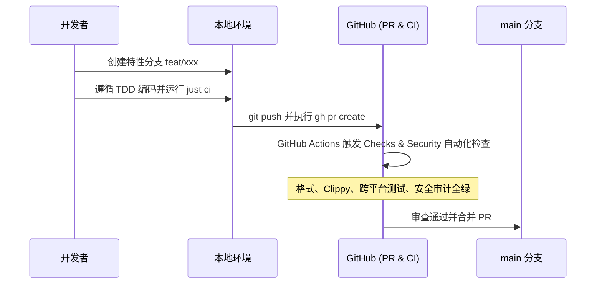

# 开发者协作手册与贡献指南

本项目遵循**云端统一构建与自动化分发哲学**。本地开发专注于功能实现与质量门禁（TDD），所有生产级发布产物均由 GitHub Actions CI/CD 流水线在干净的多平台环境中自动化编译、校验、签名并发布。

## 一、开发环境准备

系统依赖以下标准工具链：

- [Rust](https://www.rust-lang.org) (v1.98.0+ / Edition 2024)：核心系统编程语言
- [just](https://github.com/casey/just)：统一工程命令调度器
- [cargo-deny](https://github.com/EmbarkStudios/cargo-deny)：依赖安全性与合规审计工具
- [GitHub CLI (gh)](https://cli.github.com)：用于自动化 PR 创建、Release 管理与跨平台产物同步

## 二、本地开发与质量门禁

日常开发遵循**双层垂直测试驱动开发（TDD）**与静态分析约束，提交代码前必须确保门禁 100% 全绿：

```bash
# 执行全量质量门禁（代码格式 + Clippy 静态检查 + 单元/集成测试 + 安全审计）
just ci

# 单项命令
just fmt    # 自动格式化代码
just check  # 检查代码格式规范
just lint   # Clippy 严格静态分析（禁止任何 warnings）
just test   # 执行全部单元测试与 CLI 端到端验收测试
just audit  # 依赖漏洞与合规审计
```

## 三、协作与 PR 流水线

项目严格采用 PR 模式协作，禁止直接向 `main` 分支推送未经验证的业务代码：



1. 基于 `main` 分支拉取最新代码并创建特性分支；
2. 编写测试与功能实现，确保 `just ci` 100% 通过；
3. 推送分支并通过 `gh pr create` 发起 Pull Request；
4. 等待 GitHub Actions Checks 流水线验证通过后合入主干。

## 四、版本发布与 Release 流程

版本发布必须在 `main` 分支独立执行，严禁在特性分支夹带发版操作：

```mermaid
flowchart TD
    Merge[PR 合并至 main] --> CheckoutMain[切换至 main 并拉取最新代码]
    CheckoutMain --> BumpVersion[执行 just bump <version>]
    BumpVersion --> Commit[git commit -m 'chore(release): bump version to x.y.z']
    Commit --> Tag[git tag vx.y.z && git push origin vx.y.z]
    Tag --> CloudRelease[GitHub Actions release.yaml 自动构建全平台二进制并发布 Release]
    CloudRelease --> PullInstall[在本地执行 just update 从远程获取最新二进制]
```

1. **拉取主干最新代码**：
   ```bash
   git checkout main && git pull origin main
   ```

2. **同步版本号**：
   ```bash
   just bump <version>  # 示例: just bump 0.1.1
   ```

3. **创建独立发布提交并推送**：
   ```bash
   git add Cargo.toml
   git commit -m "chore(release): bump version to <version>"
   git push origin main
   ```

4. **打标并触发云端多平台构建**：
   ```bash
   git tag v<version>
   git push origin v<version>
   ```
   推送 Tag 后，GitHub Actions 自动触发 `release.yaml` 流水线，完成 macOS (Apple Silicon / Intel)、Linux (x86_64 / arm64) 以及 Windows 平台的编译、SHA256 校验和生成并发布至 GitHub Release。

## 五、从远程拉取安装与本地运行态更新

当云端 Release 编译发布完成后，在本地开发机执行更新配方：

```bash
just update
```

该脚本会自动检测当前操作系统架构，通过 GitHub CLI 或 CDN 接口从最新 Release 下载对应的独立二进制产物，并安装至 `~/.local/bin/md-outline`。
